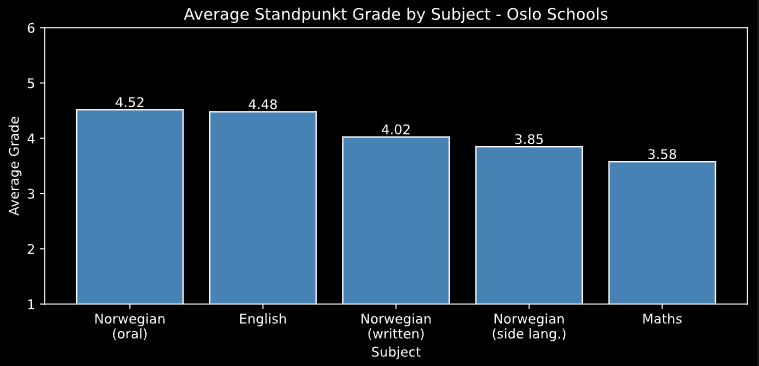
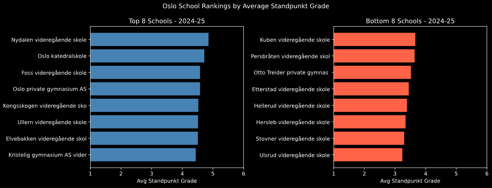

# PGR107 Python Exam (Spring 2026)

**Grade:** A

This repository contains the final group exam submission for the Python Programming course (PGR107) at Kristiania University College. The exam consisted of five independent tasks covering algorithmic thinking, debugging, geographical data processing, numerical computing with NumPy, and data analysis with visualization.

My personal contribution was **Task 5 - Grade Statistics**, detailed below.

## Task 5 - Grade Statistics: Oslo Schools 2020–2025

Analysis of standpunkt grades from all Oslo high schools over five academic years, using publicly available data from Utdanningsdirektoratet (Udir).

### Technical Focus

- **Data Wrangling:** Parsing UTF-16 encoded, tab-separated CSV files with Norwegian number formatting (decimal commas and thousand-separator spaces). Handling suppressed values (marked with `*`) as missing data, and extracting school-level records from a dataset that also contains county and national aggregates.
- **Exploratory Data Analysis:** Investigating grade distributions across 39 schools, 11 subjects, and 5 school years using pandas and matplotlib. Identifying trends, outliers, and structural patterns in the Norwegian grading system.
- **Hypothesis Testing:** Investigating whether oral Norwegian grades are consistently higher than written Norwegian grades - a pattern reported nationally by Aftenposten and Udir.

### Key Challenges

- **Data Cleaning:** The Udir CSV files use `sep=tab` headers, UTF-16-LE encoding, Norwegian decimal notation, and space-separated thousands. Missing values are represented as `*` rather than empty fields. A custom `load_file()` function handles all of this while extracting the school year from each filename.
- **Structural Comparison:** Since only standpunkt grades are available (not exam grades), the comparison between oral and written assessment profiles uses NOR1269 (oral Norwegian) and NOR1267 (written Norwegian) as proxies, running the comparison year-by-year to confirm the gap is not a one-year anomaly.
- **COVID-19 Context:** The 2020-21 school year saw written exams cancelled nationwide. This anomaly is visible in the data and must be acknowledged in the analysis without overstating its impact.

### Figures

<b>Figure 2 - Average Standpunkt Grade by Subject</b>

  

English and oral Norwegian score highest (~4.5), while Maths is the lowest (~3.6). This pattern is consistent with national data from Udir: oral assessments allow students to ask questions and recover from mistakes, while mathematical answers are objectively right or wrong, leaving less room for generous grading.

<b>Figure 3 - School Rankings by Average Standpunkt Grade (2024-25)</b>

  

There is roughly 1 full grade point separating the highest and lowest grading schools in Oslo. Top schools like Oslo Katedralskole are selective academic gymnasiums, while bottom schools serve more diverse student populations. A high standpunkt grade does not necessarily mean better student performance - it may also reflect more generous teacher grading.

### Key Findings

| Metric | Value |
|---|---|
| Overall average grade (2020–2025) | 3.96 |
| Highest scoring subject | Oral Norwegian (4.52) |
| Lowest scoring subject | Maths (3.58) |
| Oral vs. written Norwegian gap | +0.49 grade points |
| Top-to-bottom school spread | ~1.0 grade points |
| COVID effect (2020-21) | +0.3 above trend |

The oral vs. written Norwegian gap is consistent every year (0.48–0.50), confirming a structural pattern rather than a one-year anomaly. This directly supports the findings reported by Aftenposten and Udir: oral assessments are graded more generously than written ones.

### Tech Stack

- Python 3
- pandas
- matplotlib

---

*Developed as part of a group project for the Bachelor's degree at Kristiania University College.*
